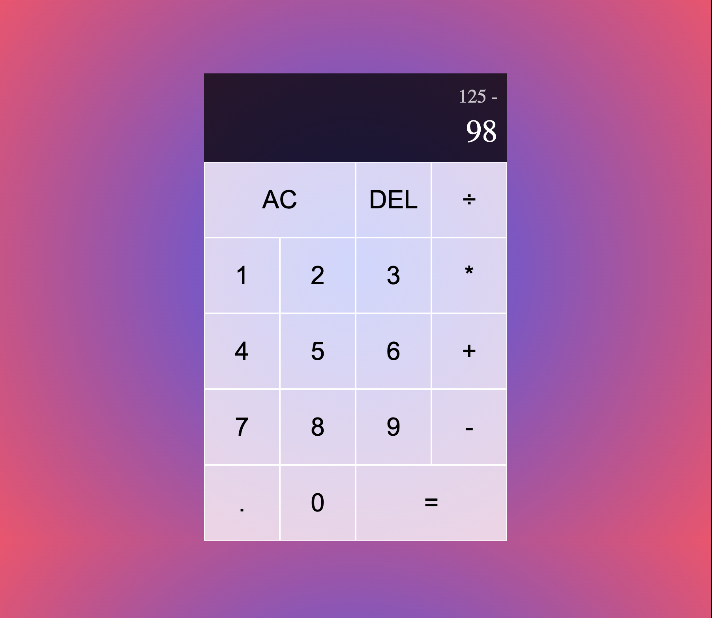

# React Calculator

## Live version: [Link](https://react-calculator-liart.vercel.app/)

## Description 
A calculator made with React  

## Built with
HTML5

CSS:
- Grid Layout;
- Pseudo-elements;
- Gradients.

React

## Developer experience 
- learned and practiced some core React concepts, such as re-renders, state management, and breaking down your code into components.

## Features
- Interactive user interface:
  buttons have hover animations;
- calculator display, which shows current operands and operator;
- real numbers input
- four operators: addition, subtraction, division, multiplication;
- ALL CLEAR and DELETE buttons;
- gradient backround;

